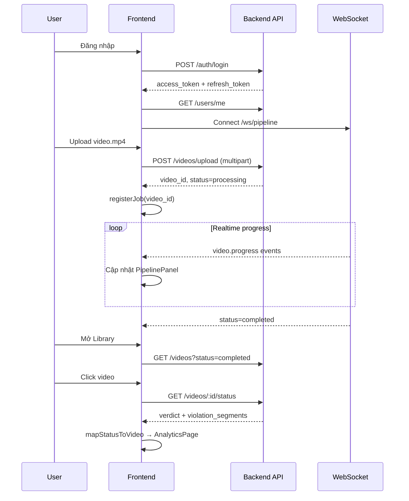

# Vigilant Lens (vidio-guard-fe) — Hướng dẫn toàn bộ dự án Frontend

Tài liệu này giải thích **toàn bộ codebase frontend** của hệ thống **Vigilant Lens** — nền tảng phân tích và kiểm duyệt nội dung video bằng AI. Đọc xong file này, bạn sẽ nắm được: dự án làm gì, tổ chức code ra sao, luồng dữ liệu chạy thế nào, và cách chạy/triển khai.

> **Lưu ý:** Repo này chỉ chứa **frontend** (React). Backend Go, AI services, Docker Compose nằm ở repo khác. Tài liệu backend/API chi tiết: [`SYSTEM_OVERVIEW.md`](./SYSTEM_OVERVIEW.md), [`API_REFERENCE.md`](./API_REFERENCE.md).

---

## Mục lục

1. [Dự án là gì?](#1-dự-án-là-gì)
2. [Công nghệ sử dụng](#2-công-nghệ-sử-dụng)
3. [Cấu trúc thư mục](#3-cấu-trúc-thư-mục)
4. [Chạy dự án & triển khai](#4-chạy-dự-án--triển-khai)
5. [Kiến trúc ứng dụng](#5-kiến-trúc-ứng-dụng)
6. [Routing & phân quyền trang](#6-routing--phân-quyền-trang)
7. [Lớp API & giao tiếp Backend](#7-lớp-api--giao-tiếp-backend)
8. [Xác thực (Authentication)](#8-xác-thực-authentication)
9. [Pipeline realtime (WebSocket)](#9-pipeline-realtime-websocket)
10. [Các module tính năng (Features)](#10-các-module-tính-năng-features)
11. [Mapping dữ liệu API → UI](#11-mapping-dữ-liệu-api--ui)
12. [Giao diện & Design System](#12-giao-diện--design-system)
13. [Luồng nghiệp vụ chính](#13-luồng-nghiệp-vụ-chính)
14. [Quy ước code & mở rộng](#14-quy-ước-code--mở-rộng)
15. [Bản đồ đọc code theo thứ tự](#15-bản-đồ-đọc-code-theo-thứ-tự)

---

## 1. Dự án là gì?

**Vigilant Lens** (tên package: `vidio-guard-fe`) là giao diện web cho phép:

| Chức năng | Mô tả |
|-----------|--------|
| **Landing / Marketing** | Trang giới thiệu sản phẩm cho khách chưa đăng nhập |
| **Đăng ký / Đăng nhập** | Email/password, Google OAuth, quên/reset mật khẩu |
| **Upload video** | Kéo-thả file, preview, gửi lên backend để AI xử lý |
| **Theo dõi pipeline** | Xem tiến độ xử lý realtime qua WebSocket |
| **Thư viện video** | Danh sách video đã xử lý, tìm kiếm, lọc, phân trang |
| **Phân tích chi tiết** | Xem video, timeline vi phạm, điểm an toàn, tải/xóa |
| **Quản lý profile** | Sửa tên, avatar, đổi mật khẩu, đăng xuất |

### Vị trí trong hệ thống lớn

```
┌─────────────────┐     REST + WebSocket      ┌──────────────────┐
│  Frontend React │ ◄──────────────────────► │  Backend Go      │
│  (repo này)     │     JWT Bearer token      │  video-api :8080 │
└─────────────────┘                           └────────┬─────────┘
                                                       │
                       ┌───────────────────────────────┼───────────────────────────────┐
                       ▼                               ▼                               ▼
                  PostgreSQL                        MinIO                          AI Services
               (metadata, verdict)              (file video)              (frame + audio moderation)
```

Frontend **không** chạy AI trực tiếp. Nó gọi API backend, nhận kết quả kiểm duyệt (`verdict`, `violation_segments`), rồi hiển thị cho người dùng.

---

## 2. Công nghệ sử dụng

| Công nghệ | Vai trò |
|-----------|---------|
| **React 19** | UI framework |
| **TypeScript** | Type-safe, toàn bộ source trong `src/` |
| **Vite 8** | Dev server, bundler, HMR |
| **React Router 7** | Client-side routing |
| **MUI (Material UI) 9** | Component library chính (Button, TextField, Dialog…) |
| **Tailwind CSS 3** | Utility classes cho layout/grid (kết hợp với MUI `sx`) |
| **Emotion** | CSS-in-JS (MUI dependency) |
| **Framer Motion** | Animation (landing page) |
| **Recharts** | Biểu đồ (analytics) |
| **react-dropzone** | Kéo-thả upload file |
| **@react-oauth/google** | Nút đăng nhập Google |

### Scripts npm

```bash
npm run dev      # Chạy dev server (mặc định http://localhost:5173)
npm run build    # Type-check + build production → thư mục dist/
npm run preview  # Xem bản build local
npm run lint     # ESLint
```

---

## 3. Cấu trúc thư mục

```
vidio-guard-fe/
├── public/                 # Static assets (icons.svg)
├── docs/                   # Tài liệu dự án
│   ├── HUONG_DAN_DU_AN.md  # ← File bạn đang đọc
│   ├── SYSTEM_OVERVIEW.md  # Kiến trúc hệ thống (backend + AI)
│   └── API_REFERENCE.md    # REST API chi tiết
├── src/
│   ├── main.tsx            # Entry point — mount React, bọc Providers
│   ├── App.tsx             # Định nghĩa tất cả routes
│   ├── index.css           # Global CSS + Tailwind + design tokens
│   │
│   ├── api/                # Lớp gọi REST API
│   │   ├── client.ts       # Fetch wrapper, auto refresh token
│   │   ├── auth.ts         # Endpoint /auth/*
│   │   ├── users.ts        # Endpoint /users/*
│   │   ├── videos.ts       # Endpoint /videos/*
│   │   ├── types.ts        # TypeScript types khớp API backend
│   │   └── errors.ts       # ApiError class, getErrorMessage()
│   │
│   ├── pages/              # Route-level components (mỏng, compose features)
│   │   ├── LandingPage/
│   │   ├── LoginPage/
│   │   ├── ForgotPasswordPage/
│   │   ├── ResetPasswordPage/
│   │   ├── UploadPage/
│   │   ├── LibraryPage/
│   │   └── AnalyticsPage/
│   │
│   ├── features/           # Logic + UI theo domain (feature-based)
│   │   ├── auth/           # AuthProvider, ProtectedRoute, form đăng nhập
│   │   ├── pipeline/       # WebSocket theo dõi tiến độ xử lý video
│   │   ├── upload/         # Upload session, dropzone, pipeline panel
│   │   ├── library/        # Grid thẻ video, skeleton loading
│   │   ├── analytics/      # Video player, violation log, safety overview
│   │   ├── videos/         # Hook useVideoDetail
│   │   ├── profile/        # Dialog sửa profile, đổi mật khẩu
│   │   └── landing/        # Trang marketing (hero, features, CTA…)
│   │
│   ├── components/         # Shared UI không thuộc 1 feature cụ thể
│   │   ├── layout/         # AppShell, Sidebar, TopBar
│   │   ├── common/         # StatusBadge, ConfirmDialog, ViolationItem…
│   │   ├── ui/             # Panel, panelStyles
│   │   └── brand/          # BrandLogo
│   │
│   ├── lib/                # Utilities thuần (không React)
│   │   ├── authStorage.ts  # localStorage tokens
│   │   ├── videoMappers.ts # Chuyển API response → model UI
│   │   ├── videoActions.ts # download, delete video
│   │   ├── format.ts       # formatBytes, formatDateTime
│   │   ├── verdict.ts      # normalizeVerdict, verdictLabelVi
│   │   ├── wsUrl.ts        # Build WebSocket URL
│   │   └── googleAuth.ts   # Đọc VITE_GOOGLE_CLIENT_ID
│   │
│   ├── theme/              # MUI theme + color tokens
│   │   ├── colors.ts
│   │   └── theme.ts
│   │
│   ├── types/              # Model UI nội bộ (Video, Violation…)
│   ├── constants/          # BRAND_NAME, BRAND_TAGLINE
│   └── data/               # mockData.ts (dữ liệu demo, ít dùng khi có API)
│
├── .env.example            # Biến môi trường mẫu
├── vite.config.ts
├── tailwind.config.js
├── tsconfig.json / tsconfig.app.json
└── package.json
```

### Nguyên tắc tổ chức

| Layer | Trách nhiệm |
|-------|-------------|
| **`pages/`** | Chỉ ghép layout + feature components. Ít logic. |
| **`features/`** | Business logic + UI của từng domain. Mỗi feature có `components/`, `hooks/`, `utils/` riêng. |
| **`components/`** | Dùng chung nhiều feature (Sidebar, ConfirmDialog…). |
| **`api/`** | Mọi HTTP call đi qua đây — component **không** gọi `fetch` trực tiếp. |
| **`lib/`** | Pure functions, không phụ thuộc React. |
| **`types/`** | Model **UI** (có thể khác shape API — mapper ở `lib/videoMappers.ts`). |

---

## 4. Chạy dự án & triển khai

### 4.1 Yêu cầu

- Node.js 18+ (khuyến nghị LTS)
- Backend Go đang chạy tại `http://localhost:8080` (hoặc URL bạn cấu hình)

### 4.2 Cài đặt & chạy dev

```bash
# Clone repo, vào thư mục
npm install

# Tạo file env
cp .env.example .env

# Chỉnh .env nếu backend không chạy localhost:8080
# VITE_API_BASE_URL=http://localhost:8080/api/v1
# VITE_GOOGLE_CLIENT_ID=<Google OAuth Client ID>

npm run dev
```

Mở trình duyệt: `http://localhost:5173`

### 4.3 Biến môi trường

| Biến | Mặc định | Mô tả |
|------|----------|-------|
| `VITE_API_BASE_URL` | `http://localhost:8080/api/v1` | Base URL REST API |
| `VITE_GOOGLE_CLIENT_ID` | (rỗng) | Client ID Google OAuth. Nếu rỗng → ẩn nút Google Sign-In |

> Vite chỉ expose biến có prefix `VITE_`. WebSocket URL được **tự derive** từ `VITE_API_BASE_URL` (đổi `http` → `ws`).

### 4.4 Build production

```bash
npm run build    # Output: dist/
npm run preview  # Serve dist/ local để test
```

Deploy `dist/` lên bất kỳ static host nào (Nginx, Vercel, Netlify, S3+CloudFront…). Cần cấu hình **SPA fallback** (mọi route trả về `index.html`) vì dùng client-side routing.

### 4.5 CORS & presigned URL

- API backend cần cho phép origin của frontend.
- Video/avatar dùng **presigned URL MinIO** — URL hết hạn sau ~1h. Frontend gọi lại API khi cần refresh URL mới.
- Nếu video không phát được: kiểm tra `MINIO_PUBLIC_ENDPOINT` và CORS trên backend (xem `SYSTEM_OVERVIEW.md`).

---

## 5. Kiến trúc ứng dụng

### 5.1 Entry point — `src/main.tsx`

Thứ tự bọc Provider (từ ngoài vào trong):

```
StrictMode
└── GoogleOAuthProvider (nếu có VITE_GOOGLE_CLIENT_ID)
    └── ThemeProvider (MUI dark theme)
        └── CssBaseline
            └── AuthProvider
                └── PipelineProvider
                    └── App (Router + Routes)
```

| Provider | File | Vai trò |
|----------|------|---------|
| `ThemeProvider` | `theme/theme.ts` | MUI theme dark mode |
| `AuthProvider` | `features/auth/AuthProvider.tsx` | State user, login/logout, bootstrap session |
| `PipelineProvider` | `features/pipeline/PipelineProvider.tsx` | WebSocket + danh sách job đang xử lý |

### 5.2 Layout ứng dụng (sau đăng nhập)

```
┌──────────────────────────────────────────────────────────┐
│ AppShell                                                  │
│ ┌──────────┐ ┌──────────────────────────────────────────┐│
│ │ Sidebar  │ │ TopBar (title, subtitle, actions)          ││
│ │          │ ├──────────────────────────────────────────┤│
│ │ • Upload │ │                                          ││
│ │ • Library│ │  Page content (Upload / Library / …)     ││
│ │          │ │                                          ││
│ │ [User]   │ │                                          ││
│ └──────────┘ └──────────────────────────────────────────┘│
│ ProfileDialogs (modal profile/password — global)          │
└──────────────────────────────────────────────────────────┘
```

- **`AppShell`**: Sidebar cố định trái + main content scroll.
- **`TopBar`**: Header từng trang.
- **`ProfileDialogs`**: Dialog sửa profile/đổi mật khẩu, mở từ Sidebar.

Landing page và trang auth **không** dùng AppShell — layout riêng.

---

## 6. Routing & phân quyền trang

Định nghĩa trong `src/App.tsx`:

| Route | Component | Bảo vệ | Mô tả |
|-------|-----------|--------|-------|
| `/` | LandingPage | GuestRoute | Trang chủ marketing |
| `/login` | LoginPage | GuestRoute | Đăng nhập / đăng ký |
| `/forgot-password` | ForgotPasswordPage | GuestRoute | Gửi OTP |
| `/reset-password` | ResetPasswordPage | GuestRoute | Đặt lại mật khẩu (query `email`, `otp`) |
| `/upload` | UploadPage | ProtectedRoute | Upload + pipeline |
| `/library` | LibraryPage | ProtectedRoute | Thư viện video |
| `/analytics/:id` | AnalyticsPage | ProtectedRoute | Chi tiết phân tích 1 video |
| `/dashboard` | → redirect `/upload` | — | Alias cũ |
| `/analysis/:id` | → redirect `/analytics/:id` | — | Alias cũ |
| `*` | → redirect `/` | — | 404 fallback |

### ProtectedRoute vs GuestRoute

**`ProtectedRoute`** (`features/auth/ProtectedRoute.tsx`):
- Chờ `AuthProvider` bootstrap xong (`isLoading`).
- Chưa đăng nhập → redirect `/login`, lưu `state.from` để quay lại sau login.

**`GuestRoute`** (`features/auth/GuestRoute.tsx`):
- Đã đăng nhập → redirect `/upload` (không cho xem landing/login nữa).

---

## 7. Lớp API & giao tiếp Backend

### 7.1 HTTP Client — `src/api/client.ts`

Mọi request REST đi qua hàm `apiRequest<T>(path, options)`:

```
Component/Hook
    → videosApi.list() / authApi.login() / …
        → apiRequest('/videos?...')
            → fetch(VITE_API_BASE_URL + path)
                → tự gắn Authorization: Bearer <access_token>
                → 401? → refresh token → retry 1 lần
                → lỗi? → throw ApiError
```

**Tính năng quan trọng:**

| Tính năng | Cách hoạt động |
|-----------|----------------|
| Auto attach JWT | Đọc token từ `localStorage` qua `authStorage.ts` |
| Auto refresh | 401 → gọi `POST /auth/refresh` → lưu token mới → retry request |
| Queue refresh | Nhiều request 401 cùng lúc chỉ refresh **1 lần** (`refreshInFlight`) |
| Session expired | Refresh fail → `clearTokens()` + dispatch event `auth:session-expired` |
| FormData | Không set `Content-Type` (browser tự set boundary) |
| 204 No Content | Trả `{}` (dùng cho DELETE video) |

### 7.2 Module API

| Module | File | Endpoints |
|--------|------|-----------|
| `authApi` | `api/auth.ts` | register, login, google, refresh, logout, forgot/reset password |
| `usersApi` | `api/users.ts` | getMe, updateProfile (multipart), updatePassword |
| `videosApi` | `api/videos.ts` | list, upload, getStatus, getDownloadUrl, delete |

Export tập trung tại `api/index.ts`.

### 7.3 Types — `api/types.ts`

Types **khớp 1:1** với JSON backend trả về. Ví dụ:

- `VideoListItem`, `VideoStatusResponse` — dữ liệu video
- `VerdictDetail`, `ViolationSegment` — kết quả kiểm duyệt
- `VideoProgressEvent` — message WebSocket
- `UserProfile` — thông tin user

### 7.4 Xử lý lỗi — `api/errors.ts`

Backend trả lỗi dạng:

```json
{ "code": 400, "type": "bad_request", "message": "..." }
```

`ApiError.fromBody()` parse thành exception. UI dùng `getErrorMessage(err)` để hiện message thân thiện.

---

## 8. Xác thực (Authentication)

### 8.1 Luồng token

```
Login/Register/Google
    → nhận { access_token, refresh_token }
    → setTokens() → localStorage keys: vg_access_token, vg_refresh_token
    → dispatch event auth:tokens-updated (PipelineProvider reconnect WS)
    → loadProfile() → GET /users/me → setUser()
```

| Token | TTL (backend mặc định) | Lưu trữ |
|-------|------------------------|---------|
| Access token (JWT) | 15 phút | localStorage |
| Refresh token (opaque) | 7 ngày | localStorage |

### 8.2 AuthProvider — `features/auth/AuthProvider.tsx`

Context cung cấp:

```typescript
{
  user: UserProfile | null;
  isAuthenticated: boolean;
  isLoading: boolean;        // true khi bootstrap lần đầu
  login, loginWithGoogle, register, logout, refreshProfile
}
```

Hook: `useAuth()` — bắt buộc nằm trong `AuthProvider`.

**Bootstrap khi F5:**
1. Có token trong localStorage?
2. Gọi `GET /users/me`
3. Fail → thử refresh token
4. Refresh fail → xóa token, `user = null`

### 8.3 Các màn auth

| Màn | View component | Chức năng |
|-----|----------------|-----------|
| Login | `LoginPageView.tsx` | Tab login/register, Google button |
| Forgot | `ForgotPasswordPageView.tsx` | Gửi email OTP |
| Reset | `ResetPasswordPageView.tsx` | Đọc query `?email=&otp=`, form mật khẩu mới |

### 8.4 Profile — `features/profile/`

- **`ProfileDialogContext`**: State mở/đóng dialog, anchor element
- **`ProfileEditDialog`**: Sửa tên + upload/xóa avatar (`PATCH /users/me` multipart)
- **`PasswordDialog`**: Đổi mật khẩu (`PATCH /users/me/password`)
- **`UserAccountMenu`**: Menu popup từ Sidebar (profile, password, logout)

---

## 9. Pipeline realtime (WebSocket)

### 9.1 Mục đích

Khi user upload video, backend xử lý **bất đồng bộ** (FFmpeg + AI). Frontend cần cập nhật progress bar realtime → dùng WebSocket.

### 9.2 PipelineProvider — `features/pipeline/PipelineProvider.tsx`

```
User đăng nhập
    → connect WebSocket: ws://host/api/v1/ws/pipeline?token=<JWT>
    → onmessage: { type: "video.progress", video_id, stage, progress_percent, status }
    → upsert vào jobsMap
    → status completed/failed → xóa khỏi danh sách đang chạy
```

| Hàm/State | Mô tả |
|-----------|--------|
| `jobs: PipelineJob[]` | Danh sách video đang xử lý |
| `registerJob(videoId, filename)` | Thêm job ngay sau upload (trước khi WS kịp push) |
| `connected: boolean` | WS đang kết nối? |
| `refreshProcessing()` | Fallback: `GET /videos?status=processing` |

**Fallback khi WS lỗi:**
- Poll REST mỗi 10 giây
- Tự reconnect WS sau 4 giây
- Khi reconnect thành công → dừng poll

**WebSocket URL** — `lib/wsUrl.ts`:
```typescript
// http://localhost:8080/api/v1 → ws://localhost:8080/api/v1/ws/pipeline?token=...
```

---

## 10. Các module tính năng (Features)

### 10.1 Landing — `features/landing/`

Trang marketing cho khách vãng lai. **Không gọi API.**

| Component | Nội dung |
|-----------|----------|
| `HeroSection` | Headline, CTA đăng ký |
| `FeaturesSection` | Tính năng sản phẩm |
| `HowItWorksSection` | Quy trình 3-4 bước |
| `PipelineVisualization` | Mô phỏng pipeline AI |
| `SecuritySection` | Bảo mật |
| `CtaSection` | Call-to-action cuối trang |
| `LandingNav` / `LandingFooter` | Navigation |

Dùng **Tailwind** nhiều hơn MUI. Animation bằng **Framer Motion**. Content tĩnh trong `constants/landingContent.ts`.

### 10.2 Upload — `features/upload/`

**Page:** `pages/UploadPage/index.tsx`

```
UploadPage
├── UploadMainArea          # Dropzone + preview + nút upload
│   └── useUploadSession    # State nhiều file local (preview blob URL)
├── PipelinePanel           # Danh sách job đang chạy + progress
└── RecentCompletedPanel    # 5 video hoàn tất gần nhất
```

**Luồng upload:**
1. User kéo file → `useUploadSession.addFiles()` → preview local
2. Bấm Upload → `videosApi.upload(file)` → `POST /videos/upload`
3. `registerJob(video_id, filename)` → hiện trên PipelinePanel
4. WS push progress → cập nhật thanh tiến độ
5. Completed → job biến mất khỏi panel, RecentCompleted refresh

**Hook `useUploadSession`:**
- Quản lý nhiều file trước khi upload
- Tạo `previewUrl` qua `URL.createObjectURL`
- Cleanup blob URL khi xóa/unmount

### 10.3 Library — `features/library/`

**Page:** `pages/LibraryPage/index.tsx`

| Tính năng | Implementation |
|-----------|----------------|
| Tìm kiếm | Debounce 400ms → query `q` |
| Lọc verdict | `filter`: all / violated / safe |
| Lọc thời gian | `days`: 0 / 7 / 30 |
| Phân trang | 12 item/trang, MUI Pagination |
| Chỉ video completed | `status: 'completed'` cố định |
| Xóa video | Optimistic UI → gọi DELETE API |

**Components:**
- `LibraryVideoGrid` — lưới thẻ video
- `LibraryVideoCard` — thumbnail, badge verdict, risk score
- `LibrarySkeleton` — loading placeholder

Click card → navigate `/analytics/:id`

### 10.4 Analytics — `features/analytics/`

**Page:** `pages/AnalyticsPage/index.tsx`

Trang chi tiết **một video** sau khi xử lý xong (hoặc đang processing — có poll).

| Component | Vai trò |
|-----------|---------|
| `VideoPlayer` | `<video src={videoUrl}>` + overlay detection box |
| `KeyViolationsLog` | Danh sách vi phạm, click → seek video |
| `SafetyOverview` | Điểm an toàn %, badge verdict (An toàn / Cảnh báo / Vi phạm) |
| `DetectionSummary` | Điểm theo category (nudity, violence, hate_speech) |
| `KeyViolationCard` | Card từng vi phạm |

**Hook:** `useVideoDetail(id)` — fetch `GET /videos/:id/status`, poll 3s nếu đang processing.

**Actions:** Tải xuống (`GET /videos/:id/download`), xóa (`DELETE /videos/:id`).

### 10.5 Videos hook — `features/videos/hooks/useVideoDetail.ts`

Tách riêng logic fetch chi tiết video để tái sử dụng. Trả về:

```typescript
{ video, chartData, loading, error, refetch }
```

---

## 11. Mapping dữ liệu API → UI

Backend và UI dùng **2 model khác nhau**. Chuyển đổi tại `lib/videoMappers.ts`.

### 11.1 Tại sao cần mapper?

| API (backend) | UI (`types/index.ts`) |
|---------------|----------------------|
| `video_id` | `id` |
| `original_filename` | `filename` |
| `risk_score` (0–1) | `safetyScore` (0–100, đảo ngược) |
| `violation_segments[]` | `violations[]` |
| `category: nudity/violence/hate_speech` | `type: explicit/violence/toxic` |
| `status: completed/failed/processing` | `status: cleared/error/processing/…` |

### 11.2 Hàm chính

| Hàm | Input | Output |
|-----|-------|--------|
| `mapListItemToVideo()` | `VideoListItem` (list API) | `Video` (thiếu violations chi tiết) |
| `mapStatusToVideo()` | `VideoStatusResponse` (status API) | `Video` (đầy đủ segments) |
| `buildTimelineChartData()` | segments + duration | data cho Recharts |

### 11.3 Verdict — `lib/verdict.ts`

Backend trả 3 mức: `safe` | `warning` | `violation`

- `violated = true` khi **warning hoặc violation**
- `verdictLabelVi()` → "An toàn" / "Cảnh báo" / "Vi phạm"

---

## 12. Giao diện & Design System

### 12.1 Hai hệ styling song song

| Hệ | Dùng ở đâu | File cấu hình |
|----|-------------|---------------|
| **MUI + Emotion** | App chính (dashboard) | `theme/theme.ts`, `theme/colors.ts` |
| **Tailwind CSS** | Landing, layout grid, utility | `tailwind.config.js`, `index.css` |

Có thể mix: MUI `Box` + class Tailwind `className="flex gap-4"`.

### 12.2 Design tokens

Theme dark **"The Digital Curator"**:
- Background: `#0b1326`
- Primary: `#b7c4ff` / container `#0052ff`
- Font headline: **Manrope**, body: **Inter**

Tokens được định nghĩa ở:
- `theme/colors.ts` — dùng trong MUI `sx={{ color: colors.primary }}`
- `tailwind.config.js` — dùng class `bg-background`, `text-on-surface`
- `index.css` `:root` CSS variables

### 12.3 Component dùng chung

| Component | File | Mô tả |
|-----------|------|-------|
| `StatusBadge` | `components/common/StatusBadge.tsx` | Badge trạng thái video |
| `ConfidenceBar` | `components/common/ConfidenceBar.tsx` | Thanh % confidence |
| `ViolationItem` | `components/common/ViolationItem.tsx` | Item vi phạm |
| `ConfirmDialog` | `components/common/ConfirmDialog.tsx` | Dialog xác nhận xóa |
| `VideoPoster` | `components/common/VideoPoster.tsx` | Thumbnail video |
| `Panel` | `components/ui/Panel.tsx` | Card/panel wrapper |
| `BrandLogo` | `components/brand/BrandLogo.tsx` | Logo Vigilant Lens |

---

## 13. Luồng nghiệp vụ chính

### 13.1 Luồng đăng nhập → upload → xem kết quả



### 13.2 Luồng refresh token tự động

```
API call bất kỳ
  → 401 Unauthorized
  → POST /auth/refresh { refresh_token }
  → OK: lưu token mới, retry request gốc
  → Fail: clearTokens(), event auth:session-expired, redirect login
```

### 13.3 Luồng quên mật khẩu

```
/forgot-password → POST /auth/forgot-password { email }
  → Email OTP (backend gửi SMTP)
  → Link: /reset-password?email=...&otp=...
/reset-password → POST /auth/reset-password
  → Buộc đăng nhập lại (refresh tokens bị revoke)
```

---

## 14. Quy ước code & mở rộng

### 14.1 Thêm trang mới

1. Tạo `pages/MyPage/index.tsx`
2. (Tuỳ chọn) Tạo feature `features/myfeature/` nếu logic phức tạp
3. Thêm route trong `App.tsx`
4. Nếu cần auth → bọc `ProtectedRoute`
5. Nếu thuộc dashboard → bọc `AppShell`, thêm nav item trong `Sidebar.tsx`

### 14.2 Thêm API endpoint

1. Thêm types vào `api/types.ts`
2. Thêm method vào module tương ứng (`videos.ts`, …)
3. Dùng `apiRequest<T>()` — không fetch trực tiếp
4. Nếu response shape khác UI model → thêm mapper trong `lib/`

### 14.3 Thêm field hiển thị từ backend

1. Backend thêm field → cập nhật `api/types.ts`
2. Cập nhật mapper `videoMappers.ts` nếu cần
3. Cập nhật component hiển thị

### 14.4 Quy ước đặt tên

| Loại | Quy ước | Ví dụ |
|------|---------|-------|
| Page | `*Page/index.tsx` | `UploadPage/index.tsx` |
| Feature view | `*PageView.tsx` hoặc `*Section.tsx` | `LoginPageView.tsx` |
| Hook | `use*` | `useUploadSession`, `useVideoDetail` |
| API module | `*Api` export object | `videosApi.list()` |
| Event custom | `auth:*` | `auth:session-expired`, `auth:tokens-updated` |

### 14.5 TypeScript

- `verbatimModuleSyntax: true` — import type dùng `import type { … }`
- `noUnusedLocals`, `noUnusedParameters` — bật strict
- Types API tách khỏi types UI (`api/types.ts` vs `types/index.ts`)

---

## 15. Bản đồ đọc code theo thứ tự

Nếu bạn mới vào dự án, đọc theo thứ tự sau:

### Bước 1 — Nắm khung sườn (30 phút)

1. `package.json` — dependencies & scripts
2. `src/main.tsx` — Providers
3. `src/App.tsx` — Routes
4. `.env.example` — Cấu hình

### Bước 2 — Hiểu giao tiếp backend (45 phút)

5. `src/api/client.ts` — HTTP client
6. `src/api/types.ts` — Shape dữ liệu API
7. `src/api/videos.ts` + `auth.ts` — Endpoints hay dùng
8. `docs/API_REFERENCE.md` — Chi tiết request/response

### Bước 3 — Auth & session (30 phút)

9. `src/lib/authStorage.ts`
10. `src/features/auth/AuthProvider.tsx`
11. `src/features/auth/ProtectedRoute.tsx`
12. `src/features/auth/LoginPageView.tsx`

### Bước 4 — Luồng chính (1–2 giờ)

13. `src/pages/UploadPage/index.tsx` + `features/upload/`
14. `src/features/pipeline/PipelineProvider.tsx`
15. `src/pages/LibraryPage/index.tsx` + `features/library/`
16. `src/lib/videoMappers.ts`
17. `src/pages/AnalyticsPage/index.tsx` + `features/analytics/`

### Bước 5 — UI & polish (tuỳ chọn)

18. `src/components/layout/` — AppShell, Sidebar
19. `src/theme/` — Colors & MUI theme
20. `src/features/landing/` — Marketing page

---

## Phụ lục A — Bảng route ↔ API sử dụng

| Trang | API endpoints |
|-------|---------------|
| Login/Register | `POST /auth/login`, `/register`, `/google` |
| Forgot/Reset | `POST /auth/forgot-password`, `/reset-password` |
| Upload | `POST /videos/upload`, `GET /videos?status=completed`, WS pipeline |
| Library | `GET /videos`, `DELETE /videos/:id` |
| Analytics | `GET /videos/:id/status`, `/download`, `DELETE /videos/:id` |
| Profile | `GET /users/me`, `PATCH /users/me`, `PATCH /users/me/password` |
| Logout | `POST /auth/logout` |

## Phụ lục B — Model Video (UI)

```typescript
// src/types/index.ts — rút gọn
interface Video {
  id: string;
  filename: string;
  status: VideoStatus;           // processing | cleared | error | …
  verdict?: 'safe' | 'warning' | 'violation';
  safetyScore: number;           // 0–100 (cao = an toàn)
  violations: Violation[];       // timeline vi phạm
  videoUrl?: string;               // presigned MinIO URL
  transcript?: string;
  duration?: number;               // giây
  violationCount?: number;
}
```

## Phụ lục C — Violation segment (API)

Backend trả segment dạng:

```json
{
  "source": "visual",
  "category": "violence",
  "start_sec": 4.0,
  "end_sec": 7.0,
  "peak_score": 0.89,
  "evidence": "frame_00005.jpg"
}
```

Frontend map thành `Violation` với `timestamp` / `endTimestamp` (giây) để seek video player.

---

## Tài liệu liên quan

| File | Nội dung |
|------|----------|
| [`SYSTEM_OVERVIEW.md`](./SYSTEM_OVERVIEW.md) | Kiến trúc full-stack, AI pipeline, database |
| [`API_REFERENCE.md`](./API_REFERENCE.md) | REST + WebSocket API đầy đủ |
| [`.env.example`](../.env.example) | Biến môi trường frontend |

---

*Tài liệu phản ánh codebase frontend tại thời điểm cập nhật. Khi thêm feature hoặc đổi API, cập nhật file này cùng commit.*
