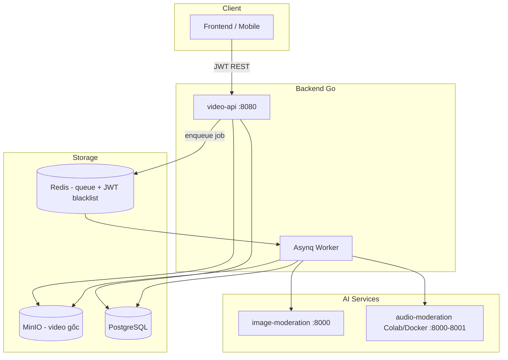
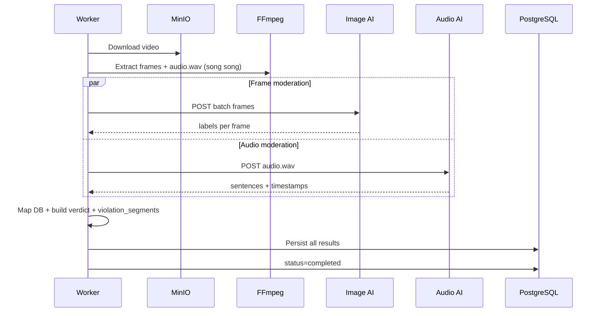
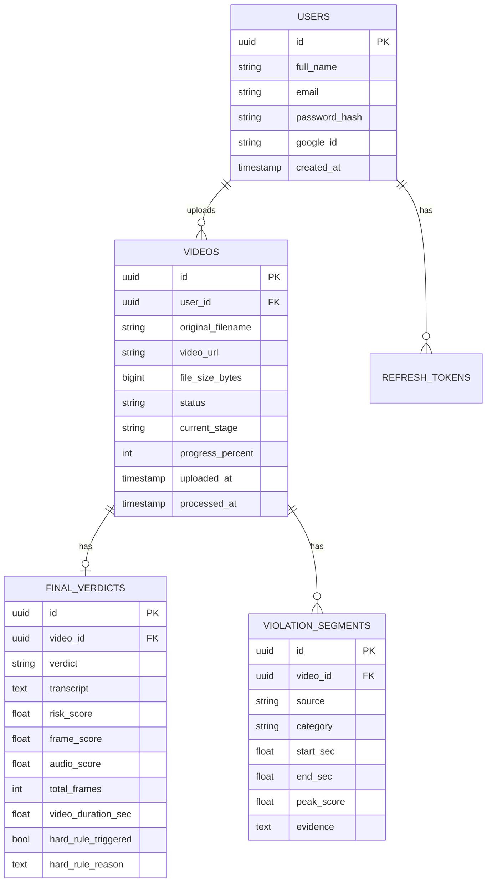
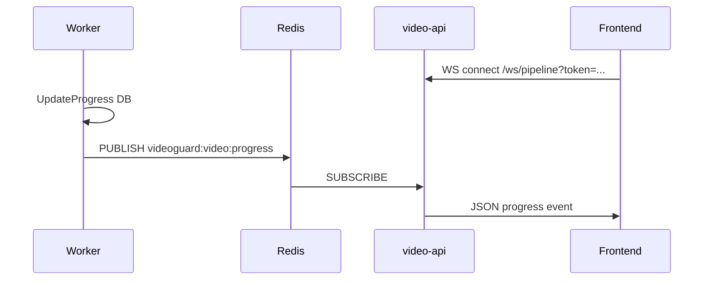
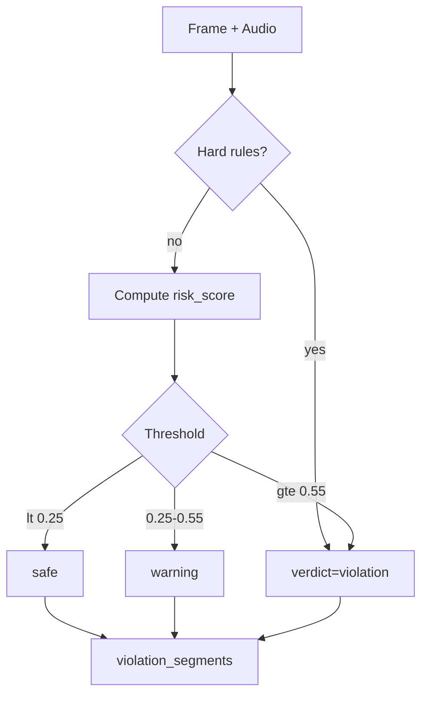

# VideoGuard — Tài liệu tổng quan hệ thống

Hệ thống **phân tích và kiểm duyệt nội dung video bằng AI**: người dùng upload video, backend trích xuất frame + audio, gọi các dịch vụ AI (hình ảnh + giọng nói), lưu kết quả vào PostgreSQL và trả verdict cùng **khoảng thời gian vi phạm** cho frontend.

---

## Mục lục

1. [Kiến trúc tổng thể](#1-kiến-trúc-tổng-thể)
2. [Thành phần hạ tầng](#2-thành-phần-hạ-tầng)
3. [Luồng xử lý video end-to-end](#3-luồng-xử-lý-video-end-to-end)
4. [Dịch vụ AI (nội bộ)](#4-dịch-vụ-ai-nội-bộ)
5. [Cơ sở dữ liệu](#5-cơ-sở-dữ-liệu)
6. [API Backend (Go)](#6-api-backend-go)
7. [Quy tắc kiểm duyệt & verdict](#7-quy-tắc-kiểm-duyệt--verdict)
8. [Biến môi trường](#8-biến-môi-trường)
9. [Triển khai & migration](#9-triển-khai--migration)

---

## 1. Kiến trúc tổng thể



| Thành phần | Vai trò |
|------------|---------|
| **video-api** | REST API: auth, upload, tra cứu trạng thái |
| **Asynq Worker** | Xử lý video nền (cùng binary Go, process riêng) |
| **MinIO** | Lưu file video gốc (`objectKey` = `{video_id}.mp4`) |
| **PostgreSQL** | Metadata, kết quả moderation, violation segments |
| **Redis** | Hàng đợi Asynq + blacklist JWT |
| **image-moderation** | EfficientNet: `safe` / `nsfw` / `violence` trên từng frame |
| **audio-moderation** | Faster-Whisper + PhoBERT: `Clean` / `Toxic` trên từng câu |

---

## 2. Thành phần hạ tầng

### Docker Compose (`docker-compose.yml`)

| Service | Port | Ghi chú |
|---------|------|---------|
| `video-api` | 8080 | API + worker (env `server/.env`) |
| `image-moderation` | 8000 | Frame classification |
| `audio-moderation` | 8001 | Thường **comment** — dùng Colab + ngrok |
| `postgres` | 5432 | DB `vidioguard` |
| `redis` | 6379 | Queue |
| `minio` | 9000 / 9001 | API / Console |
| `asynqmon-ui` | 8081 | Giám sát queue |

---

## 3. Luồng xử lý video end-to-end

### 3.1 Upload (đồng bộ — API)

1. Client `POST /api/v1/videos/upload` (multipart `file`, JWT).
2. Tạo bản ghi `videos` (`status=uploaded` → ngay sau đó `processing`).
3. Upload file lên MinIO: `objectKey = {video_id}{ext}`.
4. Enqueue task Asynq `video:process` với `{ video_id, object_key }`.
5. Trả `201` + `video_id`, `status=processing`.

### 3.2 Worker (bất đồng bộ)



**Các stage** (`current_stage` / `progress_percent`):

| Stage | Progress % |
|-------|----------------|
| `starting` | 0 |
| `frame_extraction` | 15 |
| `audio_extraction` | 35 |
| `frame_analysis` | 50 |
| `audio_analysis` | 65 |
| `aggregation` | 90 |
| `completed` | 100 |
| `failed` | — |

**Trích xuất media (FFmpeg):**

- **Frames:** `target_fps = original_fps / 3` (tối thiểu 1) + filter `select='gt(scene,0.3)+not(mod(n,10))'` + `showinfo` → `outputs/{video_id}/frames/frame_%05d.jpg`
- **Manifest:** `outputs/{video_id}/frames/manifest.json` — map tên file → `timestamp_sec` (PTS thật từ FFmpeg)
- **Audio:** mono 16 kHz WAV + normalize → `outputs/{video_id}/audio/audio.wav`
- Timestamp frame dùng **PTS thật** (`manifest.json`), không dùng số thứ tự file làm giây

**Lưu ý:** Lỗi audio moderation **không fail** cả job; video vẫn `completed` nhưng có thể thiếu segment audio.

### 3.3 Dữ liệu được persist sau khi xử lý

Kết quả AI (frame/audio) chỉ xử lý **trong RAM** của worker; DB chỉ lưu phần user cần:

| Bảng | Nội dung |
|------|----------|
| `final_verdicts` | Verdict `safe`/`warning`/`violation`, scores, transcript, hard rules |
| `violation_segments` | **Khoảng thời gian vi phạm** (visual + audio) |

Mỗi lần xử lý lại: xóa kết quả cũ theo `video_id` rồi insert mới.

---

## 4. Dịch vụ AI (nội bộ)

Go gọi qua HTTP (`server/internal/services/ai_service.go`). Timeout: **3 phút**.

### 4.1 Image moderation

- **URL:** `{AI_FRAME_MODERATOR_URL}/images/predict/batch`
- **Request:** `multipart/form-data`, field `files` (nhiều ảnh JPEG/PNG)
- **Response:**

```json
{
  "total": 2,
  "predictions": [
    {
      "frame": "frame_00001.jpg",
      "label": "safe",
      "confidence": 0.97,
      "scores": { "nsfw": 0.01, "safe": 0.97, "violence": 0.02 }
    },
    {
      "frame": "frame_00005.jpg",
      "label": "violence",
      "confidence": 0.89,
      "scores": { "nsfw": 0.03, "safe": 0.08, "violence": 0.89 }
    }
  ]
}
```

- **Nhãn:** `safe`, `nsfw`, `violence`
- **Early exit:** dừng sớm khi đủ `AI_EARLY_EXIT_COUNT` frame flagged (mặc định 3)

**Health:** `GET {AI_FRAME_MODERATOR_URL}/health`

---

### 4.2 Audio moderation

- **URL:** `{AI_AUDIO_MODERATOR_URL}/audio/predict`
- **Request:** `multipart/form-data`, field `file` (WAV/MP3)
- **Pipeline:** Faster-Whisper (tiếng Việt) → PhoBERT **2 class**
- **Nhãn:** `Clean` (0), `Toxic` (1)

**Response:**

```json
{
  "total_sentences": 2,
  "flagged_count": 1,
  "overall_label": "Toxic",
  "sentences": [
    {
      "text": "Xin chào mọi người.",
      "label": "Clean",
      "label_id": 0,
      "confidence": 0.94,
      "scores": { "Clean": 0.94, "Toxic": 0.06 },
      "start_sec": 0.0,
      "end_sec": 3.2
    },
    {
      "text": "Nội dung không phù hợp...",
      "label": "Toxic",
      "label_id": 1,
      "confidence": 0.91,
      "scores": { "Clean": 0.09, "Toxic": 0.91 },
      "start_sec": 3.2,
      "end_sec": 7.5
    }
  ]
}
```

- `start_sec` / `end_sec`: từ **Whisper segment** (giây, tính từ đầu file audio)
- `flagged_count`: số câu `label == "Toxic"`
- `overall_label`: `Toxic` nếu có ít nhất một câu Toxic

**Triển khai:**

- Production Docker: `audio-moderation/app/` (có thể chưa sync 2-class — kiểm tra trước khi deploy)
- Dev / DATN: `audio-moderation/audio_moderation_colab.ipynb` + ngrok → set `AI_AUDIO_MODERATOR_URL`

**Health:** `GET {AI_AUDIO_MODERATOR_URL}/health`

```json
{
  "status": "ok",
  "whisper_loaded": true,
  "phobert_loaded": true,
  "device": "cuda"
}
```

---

## 5. Cơ sở dữ liệu

GORM AutoMigrate khi khởi động (`server/internal/pkg/postgres.go`). Migration SQL thủ công trong `migrations/`.

### 5.1 Sơ đồ quan hệ



### 5.2 Chi tiết từng bảng kết quả

#### `videos`

| Cột | Mô tả |
|-----|--------|
| `status` | `uploaded` \| `processing` \| `completed` \| `failed` |
| `video_url` | Object key MinIO trong DB; API trả presigned GET URL (`MINIO_PUBLIC_ENDPOINT`) |
| `duration_seconds` | Thời lượng video (ffprobe khi xử lý) |
| `current_stage` | Stage hiện tại (xem bảng stage ở trên) |
| `processed_at` | Set khi `completed` |

#### `final_verdicts` (1 dòng / video)

| Cột | Mô tả |
|-----|--------|
| `verdict` | `safe` \| `warning` \| `violation` (risk scoring + hard rules) |
| `transcript` | Toàn bộ lời thoại Whisper (nối các câu), expose API |
| `risk_score` | Điểm gộp fusion frame + audio (0–1) |
| `frame_score`, `audio_score` | Điểm từng modal |
| `total_frames`, `video_duration_sec` | Metadata scoring |
| `hard_rule_triggered`, `hard_rule_reason` | Rule cứng (NSFW sustained, violence frames, toxic aggregate…) |

#### `violation_segments` (nhiều dòng / video) — **Timeline cho UI**

| Cột | Giá trị | Ý nghĩa |
|-----|---------|---------|
| `source` | `visual` \| `audio` | Nguồn phát hiện |
| `category` | `nudity` \| `violence` \| `hate_speech` | Loại vi phạm |
| `start_sec` | float | Giây bắt đầu (inclusive) |
| `end_sec` | float | Giây kết thúc |
| `peak_score` | float | Độ tin cậy cao nhất trong khoảng |
| `evidence` | text | Tên frame hoặc đoạn transcript (rút gọn) |

**Cách tạo segment:**

- **Visual:** frame flagged → interval `[ts, ts+1s]`, gộp các interval cách nhau ≤ 1s; map `nsfw` → `nudity`, `violence` → `violence`
- **Audio:** mỗi câu `Toxic` → interval `[start_sec, end_sec]` từ Whisper; gộp các khoảng overlap / cách nhau ≤ 0.5s thành một dòng

---

## 6. API Backend (Go)

> **Tài liệu API đầy đủ:** xem [API_REFERENCE.md](./API_REFERENCE.md) (request/response/lỗi từng endpoint).

**Base URL:** `http://localhost:8080`  
**Prefix:** `/api/v1`  
**Auth:** `Authorization: Bearer <access_token>` (trừ auth public)

### 6.1 Định dạng lỗi chung

```json
{
  "code": 400,
  "type": "bad_request",
  "message": "mô tả lỗi"
}
```

| HTTP | type |
|------|------|
| 400 | `bad_request` |
| 401 | `unauthorized` |
| 403 | `forbidden` |
| 404 | `not_found` |
| 409 | `conflict` |
| 500 | `internal_error` |

---

### 6.2 Auth — `/api/v1/auth`

#### `POST /auth/register`

**Body:**

```json
{
  "full_name": "Nguyen Van A",
  "email": "user@example.com",
  "password": "password123",
  "confirm_password": "password123"
}
```

**Response `201`:**

```json
{
  "id": "uuid",
  "full_name": "Nguyen Van A",
  "email": "user@example.com"
}
```

---

#### `POST /auth/login`

**Body:**

```json
{
  "email": "user@example.com",
  "password": "password123"
}
```

**Response `200`:**

```json
{
  "access_token": "eyJhbG...",
  "refresh_token": "opaque-refresh-token"
}
```

---

#### `POST /auth/google`

**Body:**

```json
{
  "id_token": "Google ID token"
}
```

**Response `200`:** giống login (`access_token`, `refresh_token`).

---

#### `POST /auth/refresh`

**Body:**

```json
{
  "refresh_token": "..."
}
```

**Response `200`:** cặp token mới.

---

#### `POST /auth/logout` (cần JWT)

**Body:**

```json
{
  "refresh_token": "..."
}
```

**Response `200`:**

```json
{
  "message": "logged out"
}
```

---

#### `POST /auth/forgot-password`

Gửi mã OTP 6 số qua email (response generic, không lộ email có tồn tại hay không).

**Body:** `{ "email": "user@example.com" }`

---

#### `POST /auth/reset-password`

**Body:**

```json
{
  "email": "user@example.com",
  "otp": "123456",
  "new_password": "newpass123",
  "confirm_new_password": "newpass123"
}
```

**Response `200`:** `{ "message": "password reset successfully" }` — thu hồi refresh token cũ.

---

### 6.3 User — `/api/v1/users` (cần JWT)

#### `GET /users/me`

Thông tin cá nhân user đang đăng nhập.

**Response `200`:**

```json
{
  "id": "uuid",
  "full_name": "Nguyen Van A",
  "email": "user@example.com",
  "avatar_url": "http://localhost:9000/videos/avatars/{user_id}.jpg?X-Amz-Algorithm=...",
  "has_password": true,
  "has_google": false,
  "created_at": "2026-01-15T08:00:00Z"
}
```

#### `PATCH /users/me`

Cập nhật `full_name` và/hoặc upload ảnh avatar (`multipart/form-data`).

| Field | Type | Bắt buộc | Mô tả |
|-------|------|----------|--------|
| `full_name` | string | yes | ≥ 2 ký tự |
| `avatar` | file | no | JPEG / PNG / WebP, max 5 MB |
| `remove_avatar` | string | no | `"true"` để xóa avatar |

Ảnh lưu MinIO `avatars/{user_id}{ext}`; response `avatar_url` là presigned URL.

**Response `200`:** cùng format `GET /users/me`.

#### `PATCH /users/me/password`

Đổi mật khẩu (tài khoản đăng ký email/password).

**Body:**

```json
{
  "current_password": "oldpass123",
  "new_password": "newpass123",
  "confirm_new_password": "newpass123"
}
```

**Response `200`:** `{ "message": "password updated" }`

Tài khoản chỉ đăng nhập Google (`has_password: false`) → `400` khi gọi đổi mật khẩu.

---

### 6.4 Video — `/api/v1/videos` (cần JWT)

#### `GET /videos` — danh sách video của user hiện tại

Dùng cho dashboard (tìm kiếm, lọc, sort, phân trang). Mặc định: **xử lý gần đây nhất** (`sort=processed_at&order=desc`).

**Query parameters:**

| Param | Mặc định | Mô tả |
|-------|----------|--------|
| `q` | — | Tìm theo tên file (`ILIKE`) |
| `status` | `all` | `uploaded` \| `processing` \| `completed` \| `failed` |
| `filter` | `all` | `violated` (có vi phạm) \| `safe` (verdict safe) |
| `days` | `0` | `7`, `30` = chỉ video có hoạt động trong N ngày gần đây; `0` = tất cả |
| `sort` | `processed_at` | `uploaded_at` \| `risk_score` \| `filename` |
| `order` | `desc` | `asc` \| `desc` |
| `page` | `1` | Trang |
| `limit` | `20` | Số item/trang (max 100) |

**Ví dụ UI “Last 7 days” + có vi phạm:**

`GET /api/v1/videos?days=7&filter=violated&sort=processed_at&order=desc`

**Response `200`:**

```json
{
  "items": [
    {
      "video_id": "550e8400-e29b-41d4-a716-446655440000",
      "video_url": "http://localhost:9000/videos/550e8400-e29b-41d4-a716-446655440000.mp4?X-Amz-Algorithm=...",
      "original_filename": "Security_Cam_04.mp4",
      "status": "completed",
      "stage": "completed",
      "progress_percent": 100,
      "file_size_bytes": 188743680,
      "uploaded_at": "2026-05-20T08:00:00Z",
      "processed_at": "2026-05-20T08:05:00Z",
      "verdict": "violation",
      "violated": true,
      "risk_score": 0.72,
      "violation_count": 3
    }
  ],
  "total": 42,
  "page": 1,
  "limit": 20,
  "total_pages": 3
}
```

| Field item | UI gợi ý |
|------------|----------|
| `video_url` | `<video src={video_url}>` — presigned MinIO, refresh khi hết TTL |
| `risk_score` | Badge % (nhân 100) |
| `verdict` | `safe` / `warning` / `violation` |
| `violation_count` | “N violation(s) detected” |
| `violated` | `true` khi `verdict != "safe"` (gồm `warning`) |
| `processed_at` | “Processed: …” |

---

#### `POST /videos/upload`

**Content-Type:** `multipart/form-data`

| Field | Type | Required |
|-------|------|----------|
| `file` | file | yes |

**Response `201`:**

```json
{
  "video_id": "550e8400-e29b-41d4-a716-446655440000",
  "video_url": "http://localhost:9000/videos/550e8400-e29b-41d4-a716-446655440000.mp4?X-Amz-Algorithm=...",
  "status": "processing",
  "stage": "starting",
  "progress_percent": 0
}
```

---

#### `GET /videos/:id/status`

Chỉ trả video của user đang đăng nhập.

**Response `200` — đang xử lý:**

```json
{
  "video_id": "550e8400-e29b-41d4-a716-446655440000",
  "video_url": "http://localhost:9000/videos/550e8400-e29b-41d4-a716-446655440000.mp4?X-Amz-Algorithm=...",
  "status": "processing",
  "stage": "frame_analysis",
  "progress_percent": 50,
  "original_filename": "clip.mp4",
  "uploaded_at": "2026-05-23T10:00:00Z",
  "processed_at": null
}
```

**Response `200` — hoàn tất (có verdict + violation segments):**

```json
{
  "video_id": "550e8400-e29b-41d4-a716-446655440000",
  "video_url": "http://localhost:9000/videos/550e8400-e29b-41d4-a716-446655440000.mp4?X-Amz-Algorithm=...",
  "status": "completed",
  "stage": "completed",
  "progress_percent": 100,
  "original_filename": "clip.mp4",
  "uploaded_at": "2026-05-23T10:00:00Z",
  "processed_at": "2026-05-23T10:05:30Z",
  "verdict": {
    "verdict": "violation",
    "violated": true,
    "risk_score": 0.72,
    "frame_score": 0.65,
    "audio_score": 0.88,
    "total_frames": 113,
    "video_duration_sec": 120.5,
    "hard_rule_triggered": false,
    "hard_rule_reason": "",
    "transcript": "Xin chào mọi người. Nội dung không phù hợp..."
  },
  "violation_segments": [
    {
      "source": "visual",
      "category": "violence",
      "start_sec": 4.0,
      "end_sec": 7.0,
      "peak_score": 0.89,
      "evidence": "frame_00005.jpg"
    },
    {
      "source": "audio",
      "category": "hate_speech",
      "start_sec": 12.4,
      "end_sec": 15.8,
      "peak_score": 0.93,
      "evidence": "đoạn nội dung toxic được phát hiện..."
    }
  ]
}
```

**Response `200` — an toàn:**

```json
{
  "video_id": "...",
  "video_url": "http://localhost:9000/videos/{id}.mp4?X-Amz-Algorithm=...",
  "status": "completed",
  "stage": "completed",
  "progress_percent": 100,
  "verdict": {
    "verdict": "safe",
    "violated": false,
    "risk_score": 0.05,
    "frame_score": 0.04,
    "audio_score": 0.08,
    "total_frames": 100,
    "video_duration_sec": 95.0,
    "hard_rule_triggered": false
  },
  "violation_segments": []
}
```

**Response `200` — thất bại:**

```json
{
  "video_id": "...",
  "video_url": "http://localhost:9000/videos/{id}.mp4?X-Amz-Algorithm=...",
  "status": "failed",
  "stage": "failed",
  "progress_percent": 0
}
```

| Trường | Khi nào có |
|--------|------------|
| `video_url` | Presigned MinIO (có thể `""` nếu presign lỗi) |
| `verdict` | `status == completed` |
| `violation_segments` | `status == completed` (mảng, có thể rỗng) |
| `processed_at` | `completed` hoặc `failed` |

---

#### `GET /videos/:id/download`

Trả presigned URL tải file (`Content-Disposition: attachment`).

**Response `200`:**

```json
{
  "video_id": "uuid",
  "download_url": "http://localhost:9000/videos/{id}.mp4?...",
  "filename": "clip.mp4",
  "expires_in_seconds": 3600
}
```

---

#### `DELETE /videos/:id`

Xóa object MinIO + bản ghi video (cascade verdict/segments). **Response `204`** (no body).

---

### 6.5 WebSocket — Active Pipeline realtime

**Endpoint:** `GET /api/v1/ws/pipeline`

**Auth:** query `?token=<access_token>` hoặc header `Authorization: Bearer ...` (trình duyệt thường dùng query).

**Luồng:**



**Message server → client:**

```json
{
  "type": "video.progress",
  "user_id": "uuid",
  "video_id": "uuid",
  "status": "processing",
  "stage": "frame_analysis",
  "progress_percent": 50
}
```

Gửi khi: đổi stage, `completed`, `failed`. Chỉ user sở hữu video nhận được event (`user_id` khớp).

**Code layout:**

| Package | Vai trò |
|---------|---------|
| `internal/realtime/` | Event, Redis publish/subscribe |
| `internal/ws/` | Hub, client pumps, handler |
| `internal/services/video_progress.go` | Persist DB + publish |

**Env:** `REDIS_PROGRESS_CHANNEL` (mặc định `videoguard:video:progress`)

**Frontend gợi ý:** kết nối WS khi mở dashboard pipeline; cập nhật progress bar từ message; fallback poll `GET /videos?status=processing` nếu WS disconnect.

---

## 7. Quy tắc kiểm duyệt & verdict

### 7.1 Frame (visual)

| Label | Flagged? |
|-------|----------|
| `safe` | Không |
| `nsfw` | Có |
| `violence` | Có |

Overall frame: ưu tiên `nsfw` > `violence` > `safe`.

### 7.2 Audio

| Label | Flagged? |
|-------|----------|
| `Clean` | Không |
| `Toxic` | Có |

### 7.3 Verdict cuối (`final_verdicts.verdict`)

Risk scoring theo **thời gian thật** (PTS frame + Whisper timestamps):

| Bước | Công thức |
|------|-----------|
| **Frame score** | `max(coverage_nsfw, coverage_violence, peak_window)` — coverage = (giây flagged merged / duration) × avg_conf; peak = max density trong cửa sổ 3s |
| **Audio score** | `max( (toxic_duration/duration)×avg_conf, peak_window_10s )` |
| **Fusion** | `fuse = α×frame + β×audio`, rồi `final = max(fuse, audio_score)` |
| **Hard rules** | Nếu trigger → `violation`; `risk_score = max(computed, 0.85)` |
| **Threshold** | `<0.25` → `safe`; `0.25–0.55` → `warning`; `≥0.55` → `violation` |

**Hard rules (mặc định, theo giây thật):**

| Mã | Điều kiện |
|----|-----------|
| `nsfw_sustained` | NSFW conf ≥ 0.90, merged span ≥ 5s |
| `violence_sustained` | Violence conf ≥ 0.85, merged span ≥ 2s |
| `violence_burst` | ≥ 3 frame violence trong cửa sổ 3s, conf TB ≥ 0.80 |
| `toxic_sustained` | Toxic liên tục ≥ 15s |
| `toxic_many_segments` | ≥ 8 câu Toxic, conf TB ≥ 0.85 |
| `toxic_total_duration` | Tổng giây toxic merged ≥ 30s |
| `toxic_coverage_ratio` | Toxic ≥ 15% thời lượng video |

**`violated`** (API): `verdict != "safe"` (gồm `warning`).

Code: [`server/internal/services/moderation_scorer.go`](../server/internal/services/moderation_scorer.go), [`frame_timeline.go`](../server/internal/services/frame_timeline.go)

### 7.4 Label weights

| Label | Weight |
|-------|--------|
| safe / Clean | 0 |
| Toxic | 2 |
| nsfw | 4 |
| violence | 5 |

### 7.5 Sơ đồ quyết định



---

## 8. Biến môi trường

File mẫu: `server/.env`

### Server / DB / Queue

| Biến | Mặc định | Mô tả |
|------|----------|--------|
| `HTTP_ADDR` | `:8080` | API listen |
| `POSTGRES_DSN` | `postgres://...` | PostgreSQL |
| `REDIS_ADDR` | `redis:6379` |
| `REDIS_PROGRESS_CHANNEL` | `videoguard:video:progress` | Redis |
| `OUTPUT_DIR` | `outputs` | Thư mục tạm FFmpeg |

### MinIO

| Biến | Mặc định | Mô tả |
|------|----------|--------|
| `MINIO_ENDPOINT` | `minio:9000` | Upload/download giữa container |
| `MINIO_PUBLIC_ENDPOINT` | `http://localhost:9000` | Host presigned URL cho browser |
| `MINIO_PRESIGN_TTL` | `1h` | TTL `video_url` |
| `MINIO_API_CORS_ALLOW_ORIGIN` | `*` (env trên `minio`) | CORS cluster-wide |
| `MINIO_ACCESS_KEY` | `minioadmin` | |
| `MINIO_SECRET_KEY` | `minioadmin` | |
| `MINIO_BUCKET` | `videos` | |
| `MINIO_USE_SSL` | `false` | |

**Phát video:** `video_url` presigned trỏ `MINIO_PUBLIC_ENDPOINT`. CORS: `MINIO_API_CORS_ALLOW_ORIGIN=*` trên service `minio` (không dùng `mc cors set` — chỉ AIStor).

### JWT

| Biến | Mặc định |
|------|----------|
| `JWT_ACCESS_SECRET` | (đổi khi production) |
| `JWT_ACCESS_TTL` | `15m` |
| `SMTP_HOST` | — | Gửi OTP quên mật khẩu (vd Gmail `smtp.gmail.com`) |
| `SMTP_PORT` | `587` | |
| `SMTP_USER` / `SMTP_PASSWORD` | — | App password SMTP |
| `SMTP_FROM` | — | Địa chỉ From (vd `Vigilant Lens <noreply@...>`) |
| `PWD_RESET_PAGE_URL` | `http://localhost:3000/reset-password` | URL trang FE reset (query `email`, `otp`) |
| `PWD_RESET_OTP_TTL` | `15m` | TTL mã OTP trên Redis |
| `PWD_RESET_COOLDOWN` | `60s` | Tối thiểu giữa 2 lần gửi mã / email |
| `JWT_REFRESH_TTL` | `168h` |
| `GOOGLE_CLIENT_ID` | Google OAuth |

### AI

| Biến | Mặc định | Mô tả |
|------|----------|--------|
| `AI_FRAME_MODERATOR_URL` | `http://image-moderation:8000` | Image service |
| `AI_AUDIO_MODERATOR_URL` | `http://audio-moderation:8000` | Audio service (Colab URL khi dev) |
| `AI_NSFW_THRESHOLD` | `0.6` | (image service nội bộ) |
| `AI_VIOLENCE_THRESHOLD` | `0.6` | |
| `AI_CHUNK_SIZE` | `32` | Frames mỗi batch |
| `AI_EARLY_EXIT_COUNT` | `3` | Dừng sớm sau N frame flagged |

### Asynq

| Biến | Mặc định |
|------|----------|
| `ASYNQ_QUEUE` | `video` |
| `ASYNQ_CONCURRENCY` | số CPU |
| `ASYNQ_MAX_RETRY` | `10` |
| `ASYNQ_TASK_TIMEOUT` | `30m` |

### Moderation scoring

| Biến | Mặc định | Mô tả |
|------|----------|--------|
| `MOD_FRAME_WEIGHT` | `0.7` | Trọng số visual |
| `MOD_AUDIO_WEIGHT` | `0.3` | Trọng số audio |
| `MOD_SAFE_THRESHOLD` | `0.25` | Ngưỡng safe |
| `MOD_VIOLATION_THRESHOLD` | `0.55` | Ngưỡng violation |
| `MOD_MAX_LABEL_WEIGHT` | `5` | Chuẩn hóa peak window |
| `MOD_HARD_RULE_FLOOR` | `0.85` | `risk_score` tối thiểu khi hard rule |
| `MOD_HARD_NSFW_CONF` | `0.90` | Hard rule NSFW |
| `MOD_HARD_NSFW_SEC` | `5` | Giây NSFW merged |
| `MOD_HARD_VIOLENCE_SEC` | `2.0` | Giây violence merged |
| `MOD_HARD_VIOLENCE_CONF` | `0.85` | Conf violence sustained |
| `MOD_HARD_VIOLENCE_BURST_COUNT` | `3` | Số frame violence trong burst |
| `MOD_HARD_VIOLENCE_BURST_CONF` | `0.80` | Conf burst violence |
| `MOD_VISUAL_MERGE_GAP_SEC` | `0.5` | Gap merge interval visual |
| `MOD_VISUAL_PEAK_WINDOW_SEC` | `3.0` | Cửa sổ peak visual |
| `MOD_AUDIO_PEAK_WINDOW_SEC` | `10.0` | Cửa sổ peak audio |
| `MOD_HARD_TOXIC_SEC` | `15` | Toxic liên tục |
| `MOD_HARD_TOXIC_COVERAGE` | `0.15` | 15% thời lượng |
| `MOD_HARD_TOXIC_SEGMENTS` | `8` | Số câu toxic |
| `MOD_HARD_TOXIC_TOTAL_SEC` | `30` | Tổng giây toxic |

---

## 9. Triển khai & migration

### Chạy hệ thống (Docker)

```bash
docker compose up -d
```

Đặt `AI_AUDIO_MODERATOR_URL` trỏ tới Colab/ngrok nếu không bật container `audio-moderation`.

### Migration SQL (chạy thủ công nếu DB đã tồn tại)

```bash
psql $POSTGRES_DSN -f migrations/004_violation_segments.sql
psql $POSTGRES_DSN -f migrations/005_slim_moderation_results.sql
psql $POSTGRES_DSN -f migrations/006_risk_scoring_verdict.sql
psql $POSTGRES_DSN -f migrations/008_drop_final_score.sql
```

| File | Nội dung |
|------|----------|
| `004_violation_segments.sql` | Tạo bảng `violation_segments` |
| `005_slim_moderation_results.sql` | Thêm `final_verdicts.transcript`; drop `frame_results`, `audio_results` |
| `006_risk_scoring_verdict.sql` | Risk scoring columns; drop peak/flagged columns; verdict `safe`/`warning`/`violation` |
| `008_drop_final_score.sql` | Drop redundant `final_score` column; keep `risk_score` only |

### Tài liệu liên quan trong repo

| File | Nội dung |
|------|----------|
| [server/docs/video-processing.md](../server/docs/video-processing.md) | Luồng worker chi tiết |
| [image-moderation/README.md](../image-moderation/README.md) | API image service |
| [system.md](../system.md) | Sơ đồ kiến trúc (có thể lệch nhẹ — ưu tiên file này) |

---

## Phụ lục: Checklist tích hợp Frontend

1. Đăng nhập → lưu `access_token`.
2. Cập nhật profile: `PATCH /users/me` với `FormData` (`full_name`, `avatar` file tùy chọn).
3. Upload video → poll `GET /videos/:id/status` hoặc WebSocket `video.progress`.
4. Phát video: `<video src={video_url} />` (presigned inline).
5. Tải video: `GET /videos/:id/download` → mở `download_url`.
6. Xóa video: `DELETE /videos/:id`.
7. Khi `status=completed`:
   - Badge theo `verdict`: `safe` / `warning` / `violation`.
   - `violated === true` cho cả `warning` và `violation`.
   - Timeline từ `violation_segments` (`start_sec`–`end_sec`).
8. Map `category` trên timeline:
   - `nudity` → nội dung nhạy cảm (visual)
   - `violence` → bạo lực (visual)
   - `hate_speech` → ngôn ngữ độc hại (audio)

---

*Tài liệu phản ánh codebase tại thời điểm cập nhật. Khi thay đổi API hoặc schema, cập nhật file này cùng commit.*
